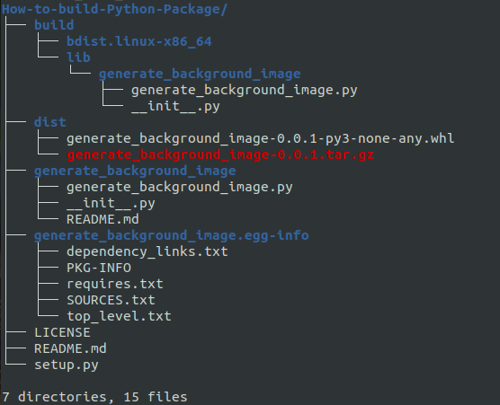

# How-to-build-Python-Package

This repo contains the instructions on how to build a Python package and publish it to [pypi.org](https://pypi.org/). For demo purposes, we are using a [pre-built repo](https://github.com/mohdsaqibhbi/Generate_text_image) with a slight modification. The pre-built repo is about generating a background image of words in a given string using the wordcloud module. A generated background image can be used in Git repos, blogs, or articles.

## Getting Started

### Instructions

1. Create a main directory e.g. [How-to-build-Python-Package](https://github.com/mohdsaqibhbi/How-to-build-Python-Package),
2. Inside the main directory, create a package directory e.g. [generate_background_image](generate_background_image).
3. Create the Python script or package you wish to publish inside the package directory e.g. [generate_background_image.py](generate_background_image.py).
4. Note down all the dependencies you have installed while writing the scripts.
5. Create a [init.py](init.py) file inside the package directory and write the below code in it.
```
from __future__ import absolute_import

__version__ = '0.0.1'
```
6. Create a [README.md](generate_background_image/README.md) file inside the package directory with all the necessary instructions required to run the package.
7. Create an account on [pypi.org](https://pypi.org/).
8. Create a [setup.py](setup.py) inside the main directory with following informations of your respective package.
```
from setuptools import setup, find_packages
import sys

with open('generate_background_image/README.md', encoding='utf-8') as readme_file:
    README = readme_file.read()

setup_args = dict(
    name='generate_background_image',
    version='0.0.1',
    description='Generate a background image of words in a given string using the wordcloud module.',
    long_description=README,
	long_description_content_type='text/markdown',
    license='MIT',
    packages=find_packages(),
    author='Mohd Saqib',
    author_email='mohdsaqibhbi@gmail.com',
    keywords=['generate image', 'background image', 'image for blog', 'image for git repo'],
    url='https://github.com/mohdsaqibhbi/How-to-build-Python-Package.git',
    download_url='https://pypi.org/project/generate_background_image/'
)
install_requires = ["wordcloud"]

if __name__ == '__main__':
    setup(**setup_args, install_requires=install_requires)
```
9. [Optional] If there are different OS-dependent dependencies to install, write them in following manners.
```
install_requires = ["python-magic;platform_system=='Linux'", "python-magic-bin;platform_system=='Windows'"]
```
10. Run [setup.py](setup.py) using `python setup.py sdist bdist_wheel`. This will generate 3 files - [build](build), [dist](dist), and [generate_background_image.egg-info](generate_background_image.egg-info).
11. Upload the package to pypi.org using `twine upload dist/*`. Enter the username and password to succesfully upload the package.
12. Voila! You have successfully published your package.

### Directory structure


## LICENSE
This project is licensed under the terms of the [MIT license](LICENSE).

## Follow me

- Follow me on Linkedin: [mohdsaqibhbi](https://www.linkedin.com/in/mohdsaqibhbi)
- Subscribe my Youtube channel: [StarrAI](https://www.youtube.com/channel/UCooZBjTCrnM3LH1nIqAmDQA)